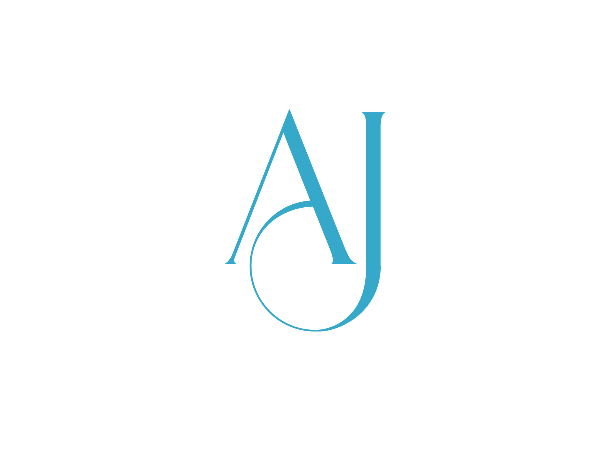

  
   
  <h3><b>Ajrass Tajemouti</b></h3>

# 📗 Table of Contents

- [📖 About the Project](#about-project)
  - [🛠 Built With](#built-with)
    - [Tech Stack](#tech-stack)
    - [Key Features](#key-features)
  - [🚀 Live Demo](#live-demo)
- [💻 Getting Started](#getting-started)
  - [Prerequisites](#prerequisites)
  - [Setup](#setup)
  - [Install](#install)
  - [Usage](#usage)
- [👥 Authors](#authors)
- [🔭 Future Features](#future-features)
- [🤝 Contributing](#contributing)
- [⭐️ Show your support](#support)
- [📝 License](#license)

# 📖 Shopper 

**Shopper** is a comprehensive online shopping platform designed to offer a seamless and intuitive shopping experience for users. It features a wide range of products across various categories such as men’s and women’s clothing, kids’ wear, accessories, and more. The app is built with a focus on user-friendly navigation, secure transactions, and efficient product management.

## 🛠 Built With 

VSCode, WSL, npm, node

### Tech Stack 

  
Reactjs

  <ul>
    <li><a href="https://react.dev/">React.js</a></li>
  </ul>

### Key Features 

> Describe between 1-3 key features of the application.

- **[Product Browsing:]**
- **[Shopping Cart]**
- **[Related Products]**

(<a href="#readme-top">back to top</a>)

## 🚀 Live Demo 

- Live Demo [Link](https://shoppercity.netlify.app/)

(<a href="#readme-top">back to top</a>)

## 💻 Getting Started 

### Prerequisites

In order to run this project you need:

### Setup

Clone this repository to your desired folder:

https://github.com/tajemouti/e-commerce-front-end.git

### Install

Install this project with:

npm install

### Usage

To run the project, execute the following command:

npm start

(<a href="#readme-top">back to top</a>)

## 👤 Author 

- GitHub: [@tajemouti](https://github.com/tajemouti)
- Twitter: [@AjrassTajemouti](https://twitter.com/AjrassTajemouti)
- LinkedIn: [ajrass](https://linkedin.com/in/ajrass)

(<a href="#readme-top">back to top</a>)

## 🔭 Future Features 

- [ ] **[Wishlist Functionality]**
- [ ] **[Advanced Search Filters]**
- [ ] **[Promotions and Discounts]**

(<a href="#readme-top">back to top</a>)

## 🤝 Contributing 

Contributions, issues, and feature requests are welcome!

Feel free to check the [issues page](../../issues/).

(<a href="#readme-top">back to top</a>)

## ⭐️ Show your support 

If you like this project give it a star.

(<a href="#readme-top">back to top</a>)

## 📝 License 

This project is [MIT](./LICENSE) licensed.

(<a href="#readme-top">back to top</a>)
